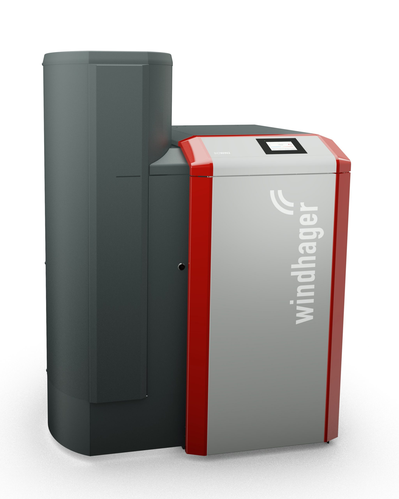
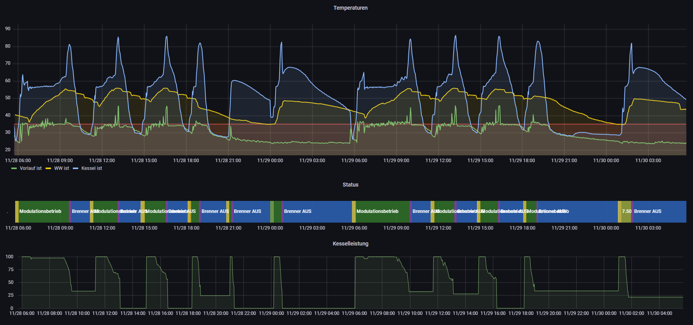
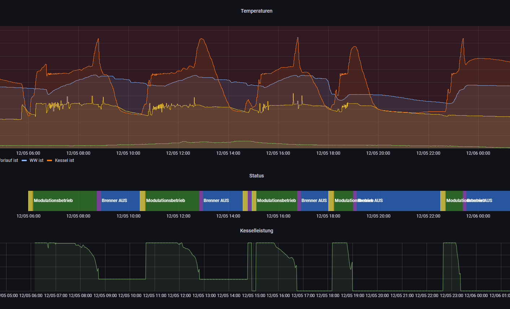
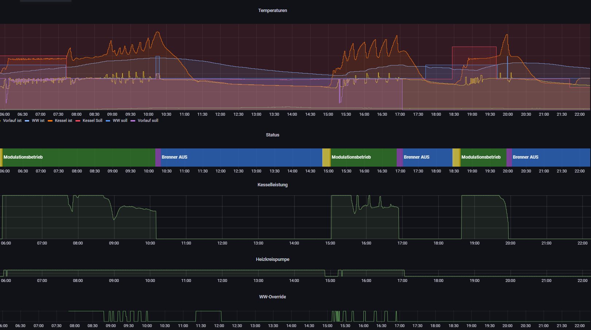
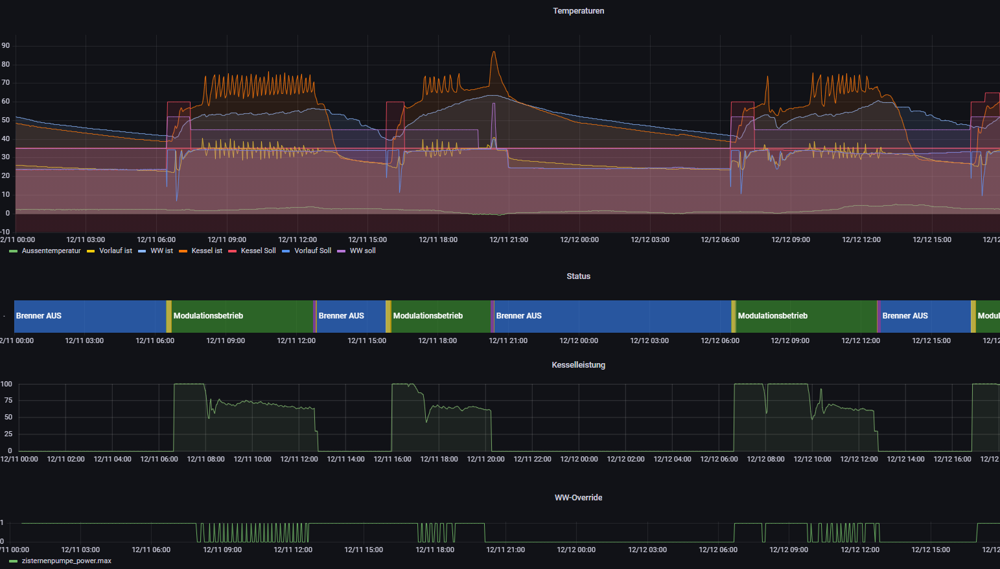
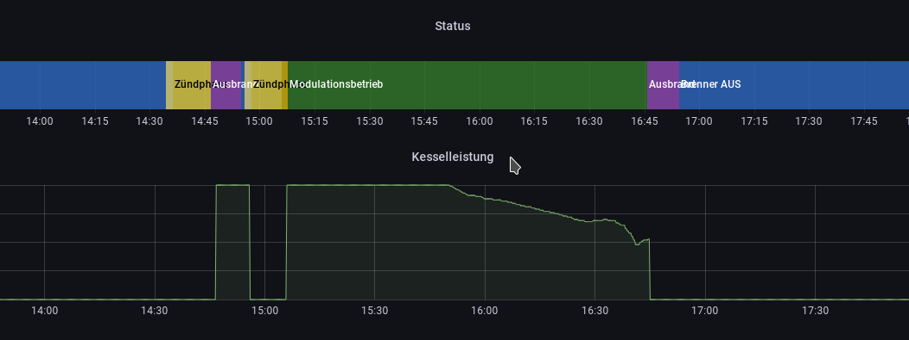
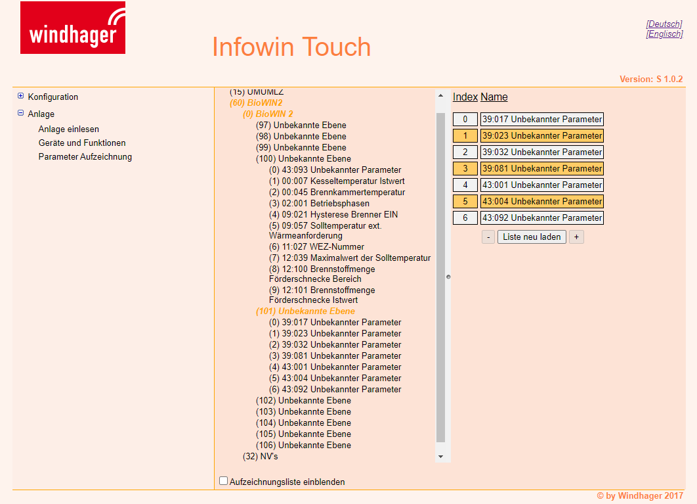

Dieses Projekt dient zum Monitoring und der Optimierung meiner BioWin2 von Windhager von 2018.

**Benutzung auf eigene Gefahr! Diese Skripte funktionieren für mich sind aber alles andere als gut getestet!**

Alle Features und Veränderungen welche ich in diesem Projekt vornehme nehmen keine Einfluss auf die BioWin2
bzw. wenn nur über zugängliche API's welche auch Dokumentiert sind.

# BioWin2

## Zugangsdaten

Laut Anleitung, default:

* User: User ; Password: 123
* User: Service ; Password: 123

# Logging

Das wichtigste Thema dieses Projekts ist das Logging der Daten der Heizung um diese evtl. zu optimieren oder zumindest Probleme zu erkennen.
Mit unten genanntem Skript windhager-influx kann dies realisiert werden sofern eine oids.txt verfügbar ist.
Eine Liste mit allen im Setup verfügbaren Datenpunkten kann mit dem Skript windhager-getall.py erstellt werden:

    $ ./windhager-getall.py --windhager <ip-address> > oids_all.txt

Diese Liste sollte danach ausgedünnt werden da zumindest bei mir viele Datenpunkte nicht relevant oder zum Teil auch einfach doppelt vorhanden sind.
Beispielhaft ist die in meinem System verwendete oids.txt im Projekt hinterlegt.

## windhager-influx.py

Simples Skript welches die Datenpunkte welche in oids.txt (--oids) gelistet sind regelmäßig abfragt und in eine InfluxDB schreibt.
In meinem Fall werden die Daten per Grafana visualisiert:

Um dieses Skript der systemd automatisch zu starten kann die Datei `windhager-influx.service` genutzt werden. Dieses muss dazu nach z.B. `/etc/systemd/system/` kopiert werden.

# Warmwasser / Brennerstarts Optimierung

Skript: ww-override.py

## Problem

Bei normalem Winter-Betrieb Zündet die Heizung bei uns (ohne Pufferspeicher) 3-6x pro Tag für lediglich 1-3h.
Die längste Zeit ist morgens wenn sowohl FBH als auch WW hochheizen. Aber insbeondere hier ist folgendes Verhalten festzustellen:

* Sobald die WW Ladung abgeschlossen ist kommt es fast immer zum Ausbrand, da die Wärme nicht abgeführt werden kann und die Kesseltemperatur >80° wird.
* Kurz darauf (<1h) wird wieder gezündet

Auch durch anpassen der Parameter für WW (Zeiten, Höhe usw.) konnte die Situation zwar "verschoben" werden aber es wurde auch immer deutlich der Komfort verschlechert. Auch mit dem Techniker wurde das Thema durchgegangen welcher auf einen Pufferspeicher verwies.

## Lösungsansatz (Winter d.h. FBH aktiv)

Dieses Skript nutzt Werte der BioWin um ein Relais (Tasmota) zu steuern welches parallel die WW-Ladepumpe schalten kann (die BioWin kann dies weiterhin auch noch!).
Die Schaltung hierfür sollte selbsterklärend sein.

Die BioWin WW-Temperaturangaben habe ich etwas verringert - aber durch die eingestellte Hysterese in der Heizung von -8K musste hier nur minimal angepasst werden.
Die WW-Anforderung der BioWin ist irgenwann vorbei. Normal würde hier der Überschwinger kommen. Hier schreitet nun dieses Skript ein in dem es folgendes tut:

Eingeschaltet wird die WW-Ladepumpe wenn:
* WW-Temperatur < ww_on oder
* Kesseltemperatur > kessel_max oder
* Kesselleitung < leistung_min

Abgeschaltet wird die WW-Ladepumpe wenn:
* Kessel Aus oder
* WW-Temperatur > ww_off oder
* Kesseltemperatur < kessel_min oder
* Kesselleitung > leistung_max

Dies hat zusätzlich zu der längeren Laufzeit den sehr scharmanten Vorteil, dass der WW-Speicher immer wieder etwas nachgeladen wird. Wird nun unter Tag viel WW Verbraucht muss die Heizung nicht erst zünden sondern schiebt einfach etwas Energie nach die vermutlich sowieso gerade zuviel ist.

## Ergebnisse:

### Erste manuelle Experimente

Hier wurde nur nebenzu die WW-Ladepumpe manuell geschaltet um ein erstes Gefühl zu bekommen. Aktiv war dies zwischen 8:00 bis 11:00 wobei ich ich den letzten Peak leider etwas zuspät abgefangen hatte. Am Nachmittag zwischen 15 und 17:00 Uhr. Auch hier habe ich beim letzten Peak zu langsam reagiert und gleich eine Zündung wegen veränderung des WW-Soll hinter her bekommen.

### Erste 1,5 Tage mit dem Skript

Zu sehen sind vier Starts in zwei Tagen. Der Morgentliche ist natürlich länger (6 Stunden, maximum der BioWin wie es scheint). Der am Nachmittag wird wohl nutzungsabhängig sein.
Noch zu untersuchen ist wie der Pelletverbrauch sich im Vergleich zu vorher entwickelt. Hierfür muss das ganze aber erst einmal eine Weile laufen.

# Bekannte Probleme

Hier werden bisher beobachtete Eigenheiten bzw. Probleme mit der Heizung aufgelistet und falls vorhanden Lösungen beschrieben.

## Zündung Ausbrand durch Brennstoffanforderung

System ist auf Brennstoffanforderung mit Vorgabezeit von 11:00 bis 15:00 Uhr eingestellt.
Zündet die Heizung kurz vor 15:00 (Ende der Freigabezeit) fällt ihr anscheinend kurz danach auf, dass sie noch Brennstoff braucht und geht direkt in den Ausbrand.

Antwort 13.12.2021 Windhager:

    wenn sie eine Freigabezeit von 12 – 15 Uhr hinterlegt habt wird der Kessel immer um kurz vor 15 Uhr in den Ausbrand gehen um eine Befüllung vor der Sperrzeit zu machen.

    Bild der Anleitung Kapitle "mit Freigabezeit" - markierung auf "Am Ende der Freigabezeit wird der Vorratsbehälter, falls notwendig, nochmals voll befüllt."

    Mit 3 Stunden Saugzeit kann es passieren das der Tagesbehälter leerläuft.

## Viele OIDs nicht per Lookup Verfügbar

Es sind einige OIDs nicht im Rekursiven Lookup zugänglich.
Durch Brute-Force Zugriffe auf kleine Bereiche wurden bisher Etliche OID's gefunden welche allerdings bisher zum Großteil nicht zugeordnet sind. Eine Liste der bisher auf meiner Anlage entdeckten OIDs is in [oids_hidden.txt](oids_hidden.txt).

Bisher wurden folgende Werte zugeordnet:

* `1/60/0/23/88/0` : Saugzuggebläse-Soll
* `1/60/0/23/89/0` : Saugzuggebläse-Ist
* `1/60/0/43/42/0` : Füllstand-Tagesbehälter (%)
* `1/60/0/43/6/0` : Unterdruck-Soll (vermutlich)
* `1/60/0/43/7/0` : Unterdruck-Ist (vermutlich)
* `1/60/0/43/8/0` : Pelletförderung-pro-Stunde (vermutlich, kg als Einheit falsch)

Folgende Werte sind noch Vermutungen:

* `1/60/0/39/111/0` : könnte Ext. Wäremeanforderung Eingang (0..10V)
* `1/60/0/43/16/0` : kg seit Reinigung oder sowas? Sprang bei letzter Reinigung von ~450 auf 0, steigt seither
* `1/60/0/43/17/0` : kg bis Reiniung oder sowas? Sprang bei letzter Reinigung von 210 auf 650, sinkt seither eq. zu 43-16

## Undokummentierte Parameter im Webinterface

Im Web-Interface des InfoWin-Touch gibt es leider etliche Einträge "Unbekannte Ebene" bzw. "Unbekannter Wert" (siehe).
Leider konnte auch der Windhager-Support (technik@de.windhager.com) hier keine Abhilfe bieten da diesem hierzu selbst keine Dokumentation vorliegen würde. Es sei ein Feuerungsautomat verbaut welche in der Weboberfläche nicht eingepflegt wurde. Ganz wichtig: "Dei Funktion ist hier vollumfänglich gegeben" (das ist doch ein Kundenservice).

Aus diesem Grund wurden per windhager-influx.py für ein paar Wochen jedgliche Parameter aufgezeichnet und versucht deren Bedeutung heraus zu finden.

* Anzahl Werte gesamt: 144
* Anzahl Werte mit Namen: 111
* Anzahl Unbekannter Werte: 67

Auch sehr ärgerlich: Manche Parameter bei denen 'writeProtect' = False ist lassen sich nicht ändern. Stattdessen läuft der Request in einen Timeout mit Bad Gateway Error.

